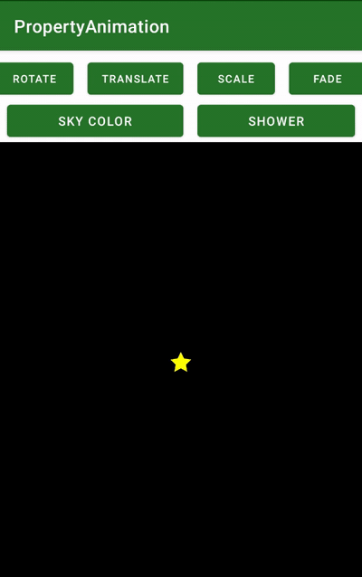

# PropertyAnimation

Android Property Animations  
Lesson 6 of [Advanced Android with Kotlin course on Udacity](https://classroom.udacity.com/courses/ud940)

Updates:

* Latest library versions (see .gradle files)
* Minor code refactoring

## Introduction

PropertyAnimation is an app that shows various types of property animations using
ObjectAnimator.

This project is the start state of the codelab, before any tasks have been started.
This is the right place to begin the codelab.
The "end" project contains the final code once all tasks are complete.

Tasks:

* Rotating the Star
* Translating the Star
* Scaling the Star
* Fading the Star
* Colorizing
* Star Shower

## Screenshots

